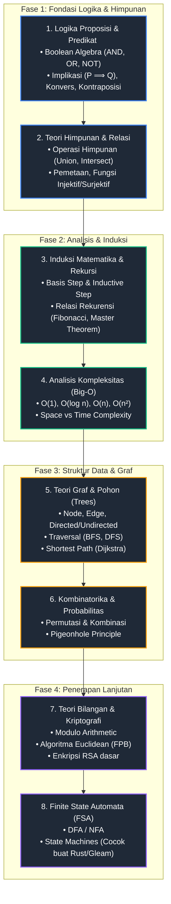

# Hi, I'm GoneSyFord(Furqon)
> *Just a high schooler turning free time into code.*

> **Halo dan salam kenal!** 
> Saya cuma anak SMA Terbuka yang suka *coding* buat ngisi waktu luang dibanding cuma *doomscrolling*. Alasan sebenarnya simpel: **saya emang nggak punya temen**. Daripada kesepian nggak ada yang diajak ngobrol, mending saya ngobrol sama *compiler* Rust. Awalnya cuma seorang *vibe coder* yang pusing pas kena error indentasi, tapi pas konsisten belajar ternyata *coding* dan matematika itu seru banget—bahkan jadi temen terbaik saya sekarang.

### 🚀 My Coding Journey
* **First Step**: Awalnya asal nyemplung ke **Python**, **Rust**, dan **Gleam**.
* **Current Focus**: Lagi asyik ngedalemim **Discrete Mathematics**, **Rust**, dan **Gleam**.
* **Goal**: Ngebangun proyek-proyek seru di bawah naungan **GSF CORP** 🤣

### 🛠️ Tech Stack & Ecosystem

 
`Flask` • `aiohttp` • `asyncio`

 
`Tokio` • `Axum` • `Ratatui` • `Leptos`

`Exploring the ecosystem`

# MyRoadmap

---

📫 **Reach me at**: *Masih Rahasia 🤫*

